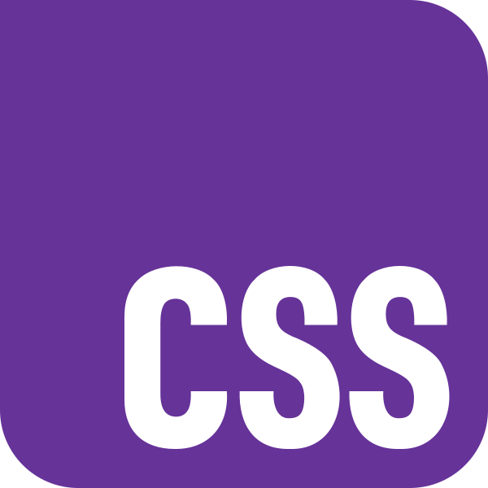
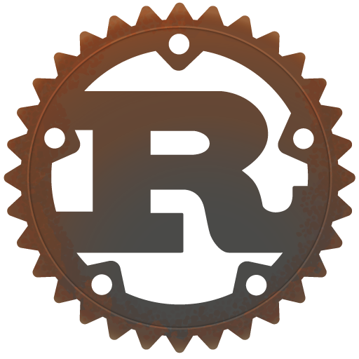

<h1 align="center">🚀 Hi, I'm 21262</h1>
<h2 align="center">A Martian Web Developer living on Earth</h2>
<h3 align="right">Making Stuff Since <i>12th of April 2021</i></h3>

    
<h3 align="left">Languages and Tools:</h3>

        
        
        
        
        
        

    

&nbsp;

&nbsp;  

- 📖 I'm currently learning **Rust.**
- 👩‍💻 I’m currently working on **a MGS2 inspired MP3 Player.**
- ⚡ I'm a huge fan of **Star Wars and Metal Gear.**
- 🏓 I'm passionate about **playing PS2 games, programming, writing, and enjoying life.**

 

     

  

   

